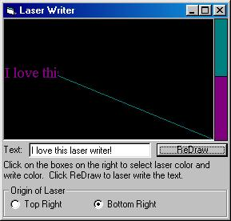

## Laser Writer

### Description

Write text using a laser effect, choose laser color and write color too! I got the idea for this when I saw the laser program that someone made that drew a picture. This works awesome, and it looks cool. See the screenshot!
 
### More Info
 

             |
---                |---
**Submitted On**   |2000-06-15 21:49:20
**By**             |[Nick Smith](https://github.com/Planet-Source-Code/PSCIndex/blob/master/ByAuthor/nick-smith.md)
**Level**          |Intermediate
**User Rating**    |4.4 (22 globes from 5 users)
**Compatibility**  |VB 4\.0 \(16\-bit\), VB 4\.0 \(32\-bit\), VB 5\.0, VB 6\.0
**Category**       |[Custom Controls/ Forms/  Menus](https://github.com/Planet-Source-Code/PSCIndex/blob/master/ByCategory/custom-controls-forms-menus__1-4.md)
**World**          |[Visual Basic](https://github.com/Planet-Source-Code/PSCIndex/blob/master/ByWorld/visual-basic.md)
**Archive File**   |[CODE\_UPLOAD67526132000\.zip](https://github.com/Planet-Source-Code/nick-smith-laser-writer__1-8905/archive/master.zip)

### API Declarations

very few, see .bas file

